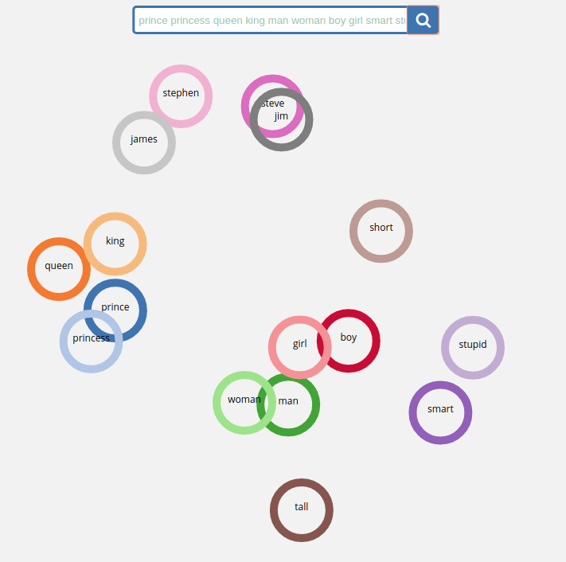
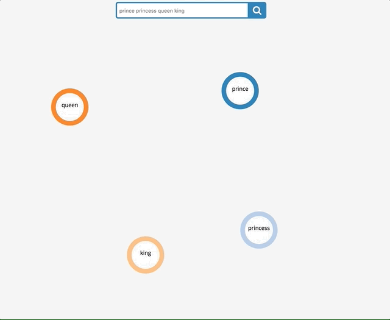

# Visualization of Word Embeddings

For this project, I wanted to explore training and visualizing a word
embedding model.

## Training

Rather than start from scratch, I chose to adapt the code from the word2vec
tutorial in the TensorFlow models repository:

[word2vec](https://github.com/tensorflow/models/tree/master/tutorials/embedding)

I followed the instructions in the README but tweaked the
`word2vec_optimized.py` script so that training could take place on
the GPU. Since I was more interested in playing with the model than tuning
hyperparameters or experimenting with TensorBoard, I ran the training with all
the parameters set to their defaults except for epochs_to_train. However, I did add a script that simply
loaded the model in an interactive shell for playing with analogies, which is
checked in here as `word2vec_interactive.py`.

**Training summary:**

```
python word2vec_optimized.py   --train_data=text8   --eval_data=questions-words.txt   --save_path=checkpoints --epochs_to_train 100
```

- Epochs: 100
- Analogy task accuracy: ~35%

The final accuracy on the analogies was not very impressive, but good enough to
get up and running with the visualization.

## Visualization



My goal was to visualize the spatial relationships between embedding vectors in
clusters of related words. I used t-SNE to visualize and perform dimensionality
reduction on the embeddings, and d3.js to run and animate the visualization.

Here is an animated example:



## API

To enable the visualization, I provided a couple of API endpoints:

*`/nearby/<word>`*

```
$ curl -i -H "Accept: application/json" -H "Content-Type: application/json" -X GET localhost:5000/nearby/king
HTTP/1.0 200 OK
Content-Type: application/json
Content-Length: 1140
Server: Werkzeug/0.12.2 Python/3.5.2
Date: Mon, 20 Nov 2017 04:17:06 GMT

{
  "nearby": [
    [
      "king",
      1.0000001192092896
    ],
    [
      "son",
      0.6477522850036621
    ],
    [
      "kings",
      0.5811713933944702
    ],
    [
      "prince",
      0.5707883834838867
    ],
    [
      "throne",
      0.5672969818115234
    ],
    ...
    [
      "scotland",
      0.4919954836368561
    ]
  ],
  "word": "king"
}
```

*`/embedding/<word>`*

```
$ curl -i -H "Accept: application/json" -H "Content-Type: application/json" -X GET localhost:5000/embedding/king
HTTP/1.0 200 OK
Content-Type: application/json
Content-Length: 5397
Server: Werkzeug/0.12.2 Python/3.5.2
Date: Mon, 20 Nov 2017 04:18:25 GMT

{
  "vec": [
    -0.09536801278591156,
    -0.10506944358348846,
    -0.07411819696426392,
    0.030329961329698563,
    0.064442940056324,
    ...
    -0.05240442231297493
  ],
  "word": "king"
}
```
