## Goal

For this project, I wanted to train a "visual" char-rnn using a standard
char-rnn model modified to use visual embeddings as inputs and outputs, and
further augmented with an MDN (rather than the usual softmax layer) so that the
output embedding vector would be probabilistically modeled.

Although this was the original goal, the LSTM part of this project didn't pan
out quite as expected - training was slow and performance wasn't increasing
rapidly enough for me to complete this project in a reasonable amount of time.
The end model was simply an MDN with a series of fully-connected networks.

I trained two separate models over the course of this project, with "APIs"
given below:

### VAEGAN
This model was trained to produce a visual character embedding of sorts using
the CADL model zoo. Here, the encoding/latent space acted as the embedding,
while the model itself acted as a codec to convert between images of characters
and embeddings.

* model input: image
* model output: image
* byproduct: an encoder, decoder, and visual embedding:
** encode(image) -> embedding
** decode(embedding) -> image

Final training reconstruction:
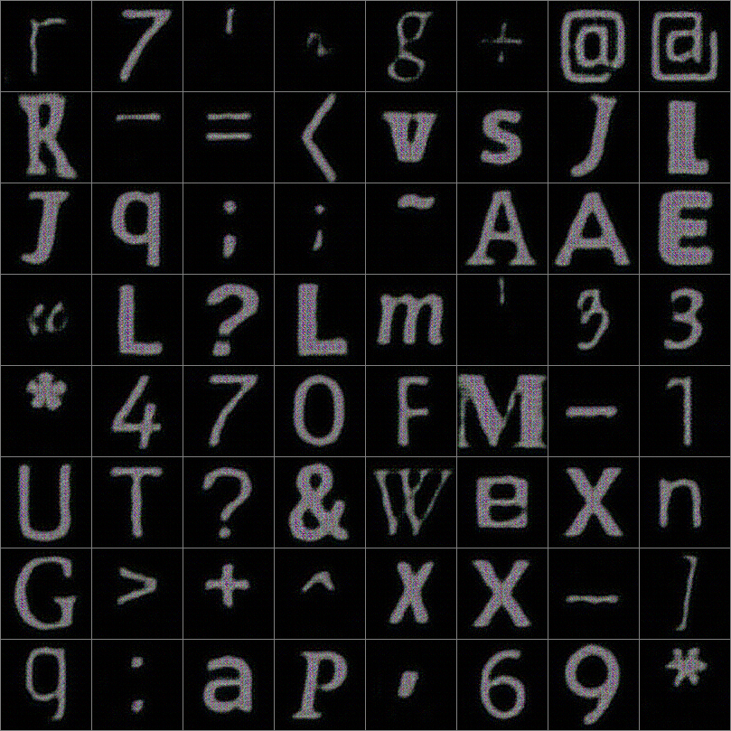

### MDN
Initially, this model was going to be the output layer(s) to an LSTM designed
to predict the next embedding in a sequence of character embeddings. However,
that proved too difficult and so I simplified this to predict the next
character of a font from the previous character.

* model input: embedding
* model output: embedding
** predict(embedding) -> embedding

[Video of training in progress](https://youtu.be/uLn3MaXLs14)

### Miscellaneous functions
* render(font, character) -> image

### Procedure

First, a VAEGAN was trained on images produced by rendering characters in
various fonts.  This resulted in the encode(image) and decode(embedding)
functions that work with visual embeddings of characters.

Here is the string "foobaz FOOBAZ" rendered for 5 random fonts (character by
character, but stacked up for display):

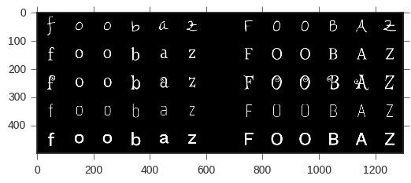

Here is the VAEGAN's reconstruction of the individual characters' images, made
by encoding the characters of that string, and then decoding the embeddings.
Each character's image and embedding is encoded/decoded independently, but all
together a single batch in TensorFlow.

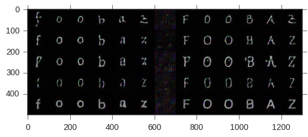

I wanted to play around with the embeddings in the latent vector space, so I
tried a couple of experiments:

1. Convert lowercase letters into uppercase letters
2. Convert a into z

Both operations captured a sense of visual and semantic information, and if
either were moderately successful, I had a decent enough embedding on my hands
that I had some confidence going to the next step of training the MDN.

#### Experiment 1

Reconstruction of capital letters from original images (same as image above):

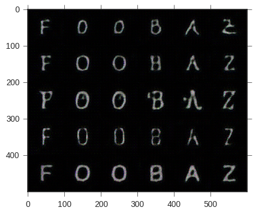

I subtracted encodings for the lowercase letters from corresponding encodings
of the uppercase letters, then averaged the results by letter. I then added the
averages back to the lowercase encodings and here are the results:

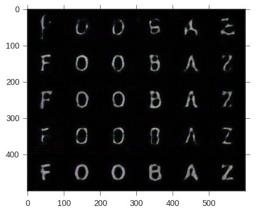

All in all, this was pretty successful.

#### Experiment 2

Reconstruction of a & z letters from original images (same as image above):

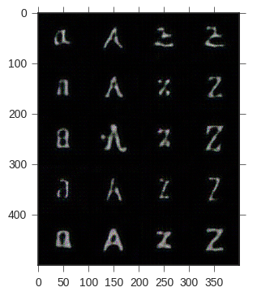

Similar to the experiment above, I took the average difference between z's and
a's and added them back to the a's, getting the results here:

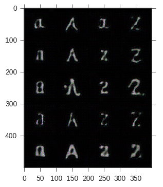

This was also pretty successful.

Next, I used the VAEGAN to construct a dataset of character-to-character
predictions, where characters were represented by their embeddings rather by
their strings or numeric indices. I originally planned to use a char-rnn model
behind the MDN on the task of predicting Trump's tweets, but ended up
simplifying the model to just an MDN and the task to predicting the next
character of a font from the previous character (in alphabetical order). In
other words, the task was to guess 'b' given 'a', 'c' given 'd', and so on, but
in the continuous embedding space rather than discrete character space. The font
was fixed for a given (input, output) pair.

Here is a video showing intermediate predictions of the MDN being trained on
this task:
[Video of training in progress](https://youtu.be/uLn3MaXLs14)

Training progressed rather unstably, both in terms of numerical stability as
well as convergence between runs. I attempted to implement a more stable loss
function and also switch to float64 instead of float32, but neither seemed to
help much. After babysitting the model for a bit to ensure the loss function
didn't start climbing, I decided that the results were good enough and stopped
training. The final model was trained on a dataset constructed from 200 fonts
and 52 characters (upper and lowercase both). It's quite possible the the model
was overfitting such a small dataset, but that was going to be tested.

Once trained, I ran the model on two related tasks:

1. (simple) Predict the next character of a font from the previous character
2. (difficult) Predict the entire font given a single character

#### Experiment 1

Although the style behind each font was not always present in the
reconstruction, the letters were generally correct and quite recognizable.

Worked well:

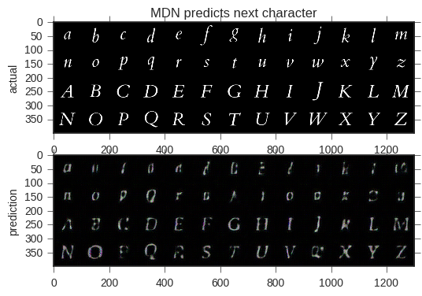

Did not work well:

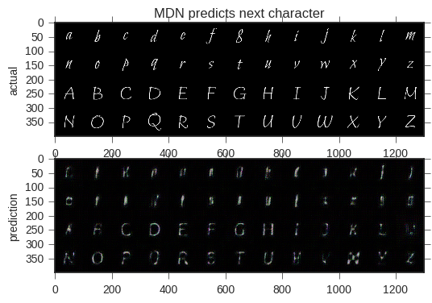

#### Experiment 2

This was a much harder task, and it's obvious from the images below that the
feedback loop started generating garbage very quickly.

Worked ok:

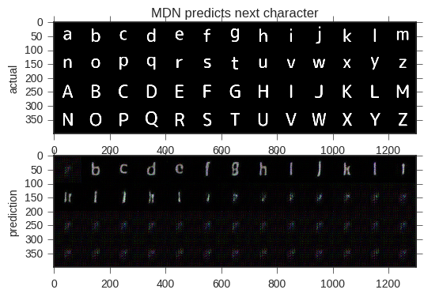

Interesting:

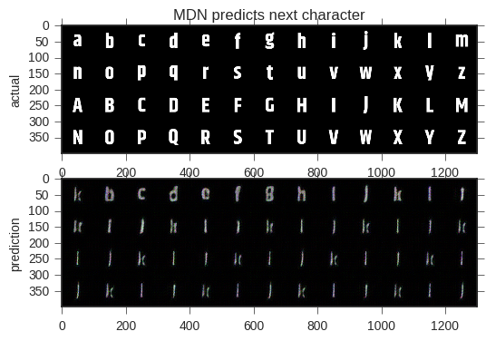

Did not work well:

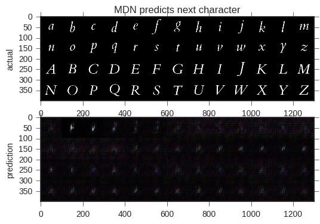

### Future work

Use non-bitmap-based approach to synthesize (eg. LSTMs like otoro blog) at
arbitrary resolutions.
