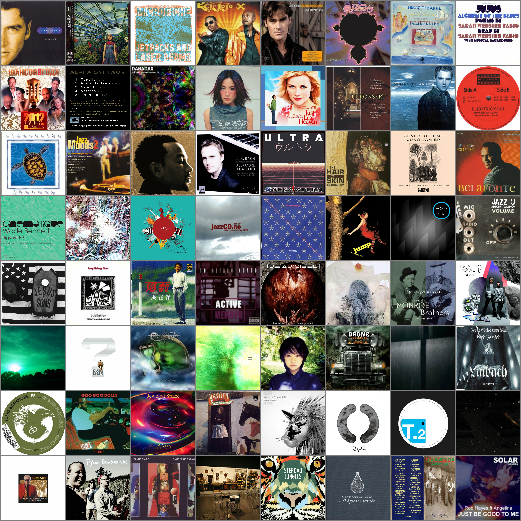
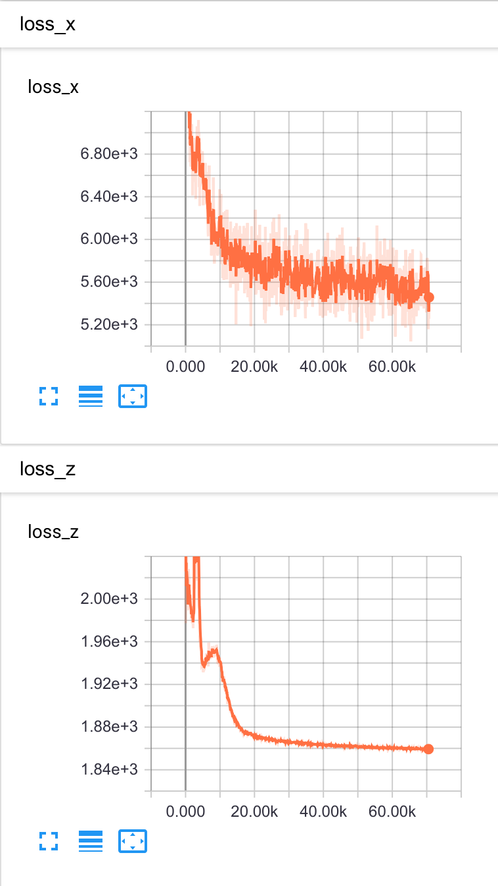
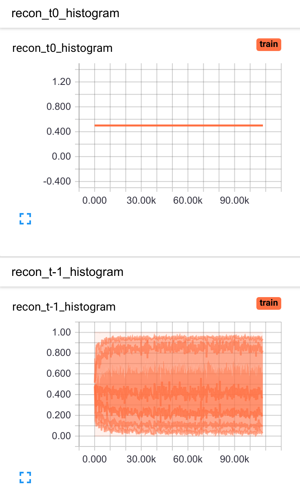
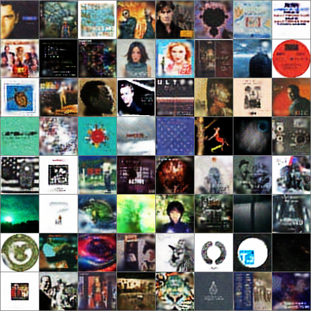

## Goal

For this project, I wanted to train a DRAW model using a new dataset of album
art covers:

[Source](https://archive.org/details/audio-covers)

To do this, I used a GCP VM with the following specs:
- 4 vCPUs
- 16 GB memory
- 1 NVIDIA Tesla K80

I ran the `[train_albums.py](train_albums.py)` for 500 epochs with a batch size
of 64, which took ~12 hours and cost ~21US$.

## Training

### Performance Graphs

### Reconstructions

Final:

Epoch 0:

Epoch 10000:

Epoch 50928:

Epoch 116832:

## Usage
