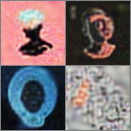

## Goal

For this project, I wanted to train a DRAW model using a new dataset of album
art covers:

[Source](https://archive.org/details/audio-covers)

To do this, I used a GCP VM with the following specs:
- 4 vCPUs
- 16 GB memory
- 1 NVIDIA Tesla K80

I ran the [train_albums.py](train_albums.py) for 500 epochs with a batch size
of 64, which took ~12 hours and cost ~21US$.

## Training

### Performance Graphs

### Reconstructions

Final:

Epoch 0:

Epoch 10000:

Epoch 50928:

Epoch 116832:

## Usage

New albums to reconstruct:

Reconstruction:

See [DRAW Experiments](DRAW\ Experiments.ipynb) for the experiment notebook.

### Observations

The "brush stroke" paints in a somewhat boring top-left to bottom-right
direction at a 45deg angle, possibly as a result of the number of timesteps
being too small for the canvas size and Gaussians in the filterbank, forcing
the network to be overly parsimonious in its use of the brush during the
limited time it has to reconstruct the image.
