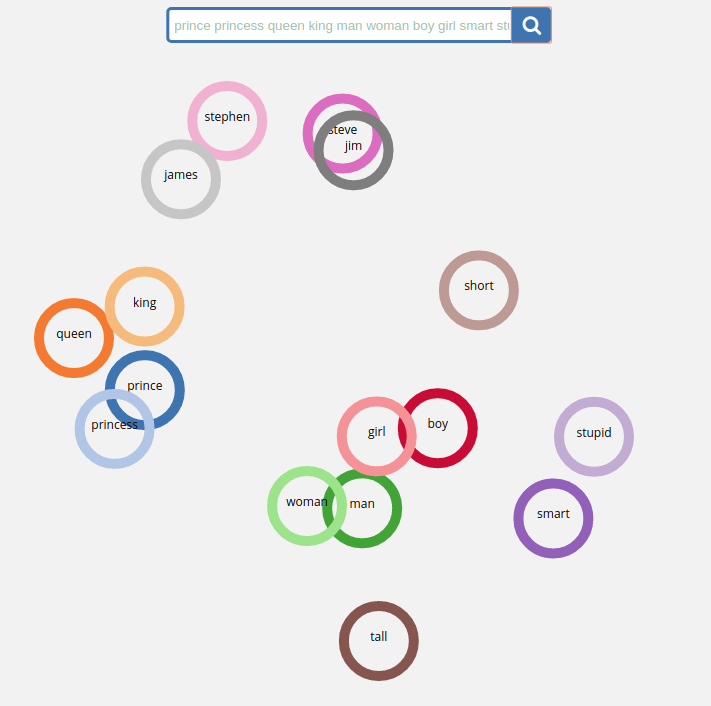

# Visualization of Word Embeddings

For this project, I wanted to explore training and visualizing a word
embedding model.

## Training

Rather than start from scratch, I chose to adapt the code from the word2vec
tutorial in the TensorFlow models repository:

[word2vec](https://github.com/tensorflow/models/tree/master/tutorials/embedding)

I followed the instructions in the README but tweaked the
`word2vec_optimized.py` script so that training could take place on
the GPU. Since I was more interested in playing with the model than tuning
hyperparameters or experimenting with TensorBoard, I ran the training with all
the parameters set to their defaults except for epochs_to_train. However, I did add a script that simply
loaded the model in an interactive shell for playing with analogies, which is
checked in here as `word2vec_interactive.py`.

**Training summary:**

```
python word2vec_optimized.py   --train_data=text8   --eval_data=questions-words.txt   --save_path=checkpoints --epochs_to_train 100
```

- Epochs: 100
- Analogy task accuracy: ~35%

The final accuracy on the analogies was not very impressive, but good enough to
get up and running with the visualization.

## Visualization


